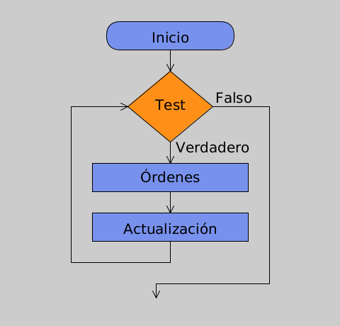

# Repeticiones

Cuando se quiere hacer lo mismo una y otra vez, es un poco aburrido
tener que escribir una y otra vez la misma palabra mágica. Por ejemplo,
imagina que queremos pintar varias líneas paralelas. Escribimos
entonces:

``` {.java bgcolor="olive!10"}
size(480, 120);
strokeWeight(8);
line(20, 40, 80, 80);
line(80, 40, 140, 80);
line(140, 40, 200, 80);
line(200, 40, 260, 80);
line(260, 40, 320, 80);
line(320, 40, 380, 80);
line(380, 40, 440, 80);
```

y obtendríamos la figura [1]. Como verás esto resulta bastante tedioso, pero
existen varias maneras de repetir las mismas instrucciones muchas veces.
Veamos una de ellas.

[Figura 1](pictures/ps12_1.png)

# El bucle `for`

Podemos hacer los mismo usando un bucle `for` (en inglés un bucle se
llama un "loop" que significa un lazo, algo que se cierra sobre sí).
Teclea la siguiente poción:

``` {.java bgcolor="olive!10"}
size(480, 120);
strokeWeight(8);
for (int i = 20; i < 400; i += 60) {
  line(i, 40, i + 60, 80);
}
```

Para repertir algo muchas veces siempre podemos usar esta construcción
con `for`. Fíjate en su definición:

``` {.java bgcolor="olive!10"}
  for (inicio; test; actualización){
    orden 1;
    orden 2;
    ....
    }
```

El bucle `for` es diferente a las palabras mágicas que hemos estado
viendo hasta hora. Fíjate que usamos dos paréntesis nuevos que
llamaremos llaves `{ }`. Las instrucciones que queremos que se repitan
van dentro de las llaves y se llama un "bloque". En
nuestro caso anterior solo usamos la intrucción de pintar una línea
`line()`. Nota también que después de cerrar un bloque con `}` no hace
falta poner `;`

Ahora fíjate en lo que va entre los paréntesis nomales de `for` `(inicio; test; actualización)`.
Los argumentos están separados no por una coma sino por `;` y se leen de
izquierda a derecha. El primero lo llamamos "inicio". En nuestro ejemplo es una variable de
tipo entero que llamamos `i` con un valor inicial de 20. Se suele usar
la letra `i` o la letra `j` pero no hay nada especial. Esta variable
sólo se usa mientras se está ejecutando el bucle y cuando acaba
desaparece, ya que está definida sólo dentro del buble.

El segundo argumento es el "test". Ahí se comprueba
si se cumple o no una condición. En nuestro ejemplo se comprueba que el
valor de la variable `i` sea menor que 20, usando el operador de
comparación `<` que significa "menor que". Si eso ocurre, se ejecutan
las instrucciones que están entre las llaves `{ }`.

Por último, el tercer argumento es la "actualización". En nuestro ejemplo, incrementamos
el valor de la variable `i` en 60. Recuerda que `i+=60` significa hacer
`i=i+60`, esto es coger el valor que tenía, sumarle 60 y guardar en la
caja el nuevo valor, perdiendo el antiguo.

En la figura [2] podemos ver dibujado el orden en el que
se ejecuta el bucle y cómo la condición del test controla las órdenes
del bloque. Se llama un diagrama de flujo y nos permite ver cómo
funciona la ejecución de un comando, en este caso el bucle `for`.



# Explorando dentro del bucle

Para comprender lo que sucede en el bucle, vamos a incluir nuestra
palabra mágica `println()`. Siempre que queramos ver cómo funciona un
bloque de código o cualquier parte una poción es la palabra que nos
permite depurar y detectar fallos. El código queda:

``` {.java bgcolor="olive!10"}
size(480, 120);
strokeWeight(8);

for (int i = 20; i < 400; i += 60) {
  println(i);
  line(i, 40, i + 60, 80);
}

println("Hemos salido del bucle");
```

Si miras en la cónsola, podemos ver que inicialmente `i=20`, A
continuación comprueva que es menor que 400, y entonces escribe este
valor a la cónsola y pinta una línea entre los puntos (20,40) y
(20+60,80). Hecho esto actualiza `i` sumándole 60 según la instrucción
de `i+=60`, con lo cuál `i=80`. Vuelve a comprobar que es $<$ 400 y
vuelve a escribir su valor y a pintar otra línea, esta vez entre los
puntos (80,40) y (80+60,80). Así hasta que llega al valor 380. La última
línea que pinta es entre los puntos (380,40) y (380+60,80). Cuando
actualiza el valor sumándole 60 resulta `i=440`. Como es mayor que 400,
entonces ya no hace nada y el programa continuaría fuera del bucle.
Hemos añadido una `println()` para ver cuándo estamos fuera del bucle.

Nota que si escribimos entre dobles comillas una frase, dentro de los
paréntesis de `println()`, Processing nos escribe la misma frase en la
cónsola. Prueba a escribir una dentro del bloque `{}` que diga

``` {.java bgcolor="olive!10"}
 println("Estamos dentro del bucle");
```

Puedes además imprimir el valor de la variable en la misma línea.
Escribe

``` {.java bgcolor="olive!10"}
 println("Estamos dentro del bucle",i);
```

Ahora vemos el mensaje y el valor de la variable `i` en la misma línea
de la cónsola. Seguiremos viendo más usos de `println()`.

El cuble `for` es uno de nuestros conjuros más poderosos. Te permite
lanzar muchas órdenes seguidas con poco esfuerzo. Un cambio en el bloque
entre las llaves `{}` se amplifica por el bucle muchas veces. No te
saltes el siguiente apartado y experimenta este nuevo conjuro. Verás que
podemos crear muchos motivos gráficos.

# Experimenta tus pociones

1.  Vamos a modificar nuestra poción. Escribe:

    ``` {.java bgcolor="olive!10"}
    size(480, 120);
    strokeWeight(2);
    for (int i = 20; i < 400; i += 8) {
      line(i, 40, i + 60, 80);
    }
    ```

    Obtendrás la figura [3](#fig:ps12_2){reference-type="ref"
    reference="fig:ps12_2"} ¿Puedes decir qué hemos cambiado? Cambia a
    un espacio de 6 píxeles entre líneas en vez de 8.

    [Figura 3](pictures/ps12_2.png){#fig

2.  Vamos a modificar otra vez el código de manera que las se van
    abriendo y nos da perspectiva. Escribe ahora:

    ``` {.java bgcolor="olive!10"}
    size(480, 120);
    strokeWeight(2);
    for (int i = 20; i < 400; i += 20) {
      line(i, 0, i + i/2, 80);
    }
    ```

    Obtendrás la figura [4]. Si quieres ver los valores de las
    coordenadas $x$, introduce dentro del bloque la siguiente linea:

    ``` {.java bgcolor="olive!10"}
    println("x_inicial =",i, "x_final=", i + i/2);
    ```

    ¿Cuál es la coordenada x de la última línea que pintamos? Observa
    que se sale de la ventana del dibujo. Si la haces más grande la
    ventana, cambiando a `size(570,120)` podrás verla completa.

    [Figura 4](pictures/ps12_3.png)

3.  Podemos hacer que parezca que las líneas se doblan. Añade otra orden
    en dentro del bloque para pintar otra línea. Escribe:

    ``` {.java bgcolor="olive!10"}
    size(480, 120);
    strokeWeight(2);
    for (int i = 20; i < 400; i += 20) {
      line(i, 0, i + i/2, 80);
      line(i + i/2, 80, i*1.2, 120);
    }
    ```

    y obtendrás la figura [5](#fig:ps12_4). ¿Cómo puedes cambiar el doblez? Busca en el
    bloque el valor de 1.2, cámbialo y verás.

    [Figura 5](pictures/ps12_4.png)
