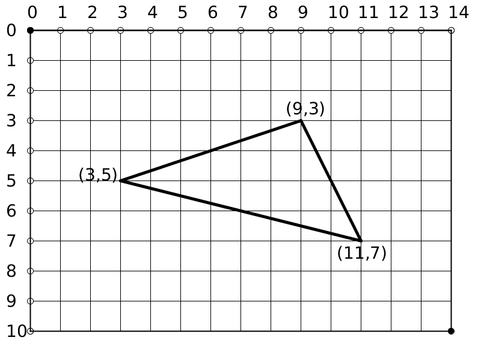

# La función que crea el papel

Para dibujar en la pantalla lo primero es crear el papel. Eso se hace
con la palabra mágica `size()`.

La palabras mágicas también se llaman funciones. Normalmente las
funciones tienen nombres que permiten recordar lo que hacen. Así que
`size()` que en inglés significa tamaño permite crear una ventana de un
cierto tamaño.

A las funciones les podemos dar o pasar argumentos. Una función lee sus
argumentos y actúa en consecuencia. Los argumentos de size son dos
números. El primero da el número de puntos horizontales (píxeles) que
queremos que tenga la ventana, el segundo el número de puntos
verticales.

Para dibujar una ventana de 800 puntos de ancha y 600 puntos de alta
escribiríamos,

``` {.java bgcolor="olive!10"}
size(800, 600);
```

&iexcl;Muy importante! Las funciones que caben en una sola línea hay que
acabarlas con un punto y coma `;` o el ordenador se cree que no ha
terminado la orden y se queda esperando, dando lugar a un error.

Nota: A veces usaremos la expresión 800x600 para indicar una ventana de
800 de ancho por 600 de largo.

# Coordenadas cartesianas

Una vez que tenemos creado una ventana, si queremos decirle al ordenador
que pinte en ella tenemos que decirle en dónde. Usaremos la receta de
otro gran mago llamado Descartes.

Descartes primero ideó una manera de situar puntos en un papel
cuadriculado. Se le ocurrió enumerar las líneas verticales y
horizontales, y así obtener un sistema de coordenadas. Sólo hace falta
ponerse de acuerdo en el orden de los números y podemos situar cualquier
punto en el papel. Luego se imaginó que cualquier sobre cualquier papel
aunque no sea cuadricualado podemos imaginarnos que lo es y usar el
mismo método.



En la figura [1] podemos ver el sistema cartesiano que usa Processing. Processing enumera
el papel que hemos creado de izquierda a derecha y de arriba a abajo.
Empieza siempre con el número 0.

Así si quires localizar los vértices del triángulo de la figura vemos
que el de la izquierda está en la cuarta línea vertical hacia la
izquierda, y como hemos empezado con el cero, corresponde al número 3.
Si vamos de arriba a abajo, vemos que el vértice está sobre la décima
línea horizontal, pero como empezamos con el cero, la línea es la número
9. Así el vértice es $(3,9)$ que es donde se corta la línea vertical con
la horizontal. Al par de número $(3,9)$ se le llama coordenadas.
Comprueba las coordenadas del resto de los vértices de la figura.

# Dibuja punto

La función mágica para que aparezca un punto en una posición es
`point()`.Es fácil de recordar, porque "point"significa punto en inglés
y se escribe parecido. A esa función tenemos que pasarle como argumentos
las coordenadas del punto (X,Y) en donde X indica la línea vertical
hacia la derecha y Y la línea horizontal hacia abajo. y escribiríamos:

``` {.java bgcolor="olive!10"}
point(X,Y);
```

Vamos a crear una papel con 480 puntos de ancho y 120 de alto o en
notación abreviada 480x120. Si queremos pintar un punto en el medio, el
punto estaría situado en la línea vertical X=240, y en la línea
horizontal Y=120. Escribimos:

``` {.java bgcolor="olive!10"}
size(480, 120);
point(240, 60);
```

Al ejecutar nuestro hechizo aparece una ventana con un punto muy pequeño
en el centro (hay que fijarse bien) como se muestra en la figura
[2].

[Figura 2](pictures/ps3_2.png)

El punto que está más lejos del origen es el punto que está más
desplazado hacia la derecha y hacia abajo. Tenemos 480x120 puntos, y
hemos empezado a contar el cero, pasí que la última línea hacia la
derecha lleva el número $$480-1=479,$$ mientras que como tenemos 120
líneas horizontales, contando la primera línea hacia abajo como 0, la
última tiene asignado el número $$120-1=119.$$ Puedes por tanto pintar
el origen y el final de la ventana con las órdenes

``` {.java bgcolor="olive!10"}
point(0,0);
point(479,119);
```

Si intentas pintar un punto fuera del papel, pues no se pinta. Intenta

``` {.java bgcolor="olive!10"}
point(500,60);
point(240,130);
point(480,120);
```

y no verás nada. Es claro que el primer punto está muy a la derecha. El
segundo demasiado bajo, y el tercero se sale por un punto de más hacia
la derecha y por un punto de más hacia abajo.

# Uniendo puntos con líneas

La distancia más corta entre dos puntos en un papel es la línea recta.
Si queremos dibujar una línea recta que una dos puntos tenemos otra
palabra mágica `line()`. Tenemos que decirle cuál es el punto origen y
cuál es el punto final y Processing pintará una línea entre ellos. Si el
punto origen tiene de coordenadas (X1,Y2) y el punto final las
coordenadas (X2,Y2), escribiríamos:

``` {.java bgcolor="olive!10"}
line(X1,Y1,X2,Y2);
```

Así, para unir los vértices (3,9) y (11,7) le daríamos a `line()` 4
argumentos y escribiríamos `line(3,9,11,7);`

Si queremos una ventana de (420,120) y dibujar sobre ella una línea que
una los puntos (30,100) y (440,20) escribiríamos

``` {.java bgcolor="olive!10"}
size(480, 120);
line(30, 100, 440, 20);
```

y obtendríamos la figura [3].

[Figura 3](pictures/ps3_3.png)

# Experimenta tus pociones

1.  Crea un papel o ventana de 100x150. Pinta el punto medio, el origen
    y el punto más alejado del origen.

2.  Dibuja un triángulo. Pista: necesitas 3 puntos, toma los puntos de
    dos en dos y dibuja líneas entre cada par de puntos.

3.  Dibuja un cuadrado de 50 puntos de lado. Pista; necesitas 4 puntos
    de la forma (X,Y), (X+50,Y), (X,Y+50), (X+50,Y+50). Necesitas unir
    los puntos con 4 líneas.

4.  Pinta las diagonales del cuadrado anterior. Pista: pinta 2 líneas
    más uniendo los vértices opuestos (los vértices más alejados entre
    sí).
