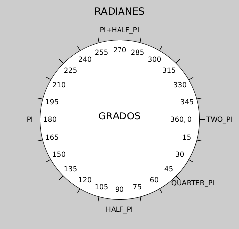

# Elipses y círculos

Para dibujar curvas con Processing, tenemos varias palabras mágicas. Ya
hemos visto una que dibuja una elipse como la mostrada en la figura
[1].

[Figura 1](pictures/ps5_1.png)

Para dibujar una elipse empleábamos la función `ellipse()`, con 4
parámetros: las coordenadas del centro O, y las longitudes de los ejes
AB y CD.

``` java
ellipse(X0, Y0, AB, CD);
```

Un círculo es un caso especial de elipse, en donde las longitudes de los
ejes AB y CD son iguales y se llaman diámetros. La distancia del centro
O a cualquier punto de la curva se llama radio y es la mitad del
diámetro. Así, si queremos dibujar varios círculos podemos escribir como
hemos visto ya también

``` java
size(480, 120);
ellipse(278, -100, 400, 400);
ellipse(120, 100, 110, 110);
ellipse(412, 60, 18, 18);
```

y aparecerán círculos de diámetros 400, 118 y 18.

Fíjate en algo curioso. Ya hemos comentado que si la figura no cabe en
el papel que hemos creado, se pinta solo una parte. Pero en el caso del
círculo de 400 de diámetro, el centro lo hemos elegido en (278, -100).
Eso significa que nos desplazamos en el papel hacia la derecha 278
puntos o píxeles, y hacia abajo -100. ¿Qué significa hacia abajo -100?
Pues como es negativo, cambiamos la dirección y subimos hacia arriba
desde la esquina superior del papel, es decir, estamos escogiendo el
centro fuera del papel hacia arriba. Cambia este valor de -100 a -50, 0,
50, 100, 150, 200 respectivamente y verás que es como una puesta de sol,
el círculo aparece por arriba y se oculta por abajo. Los valores
negativos indican un cambio de dirección cuando contamos (contar hacia
el otro lado).

Como el círculo es un caso especial, como nos pasaba con el cuadrado y
el rectángulo, Processing también tiene una palabra especial:
`circle()`. Así solo tenemos que darle las coordenadas del centro y el
valor del diámetro. En el ejemplo anterior podemos añadir un círculo con
el centro en (240,60) de radio 30 escribiendo

``` java
circle(240, 60, 30);
```

# Pi, el número más mágico

Imaginemos que cogemos un metro y cortamos una cuerda de manera que mida
un número entero de centímetros, por ejemplo 60 cm. Si formamos un
círculo con la cuerda, y con el mismo metro medimos su diámetro, veremos
que la relación es aproximadamente 1 a 3. El círculo mide 3 veces su
diámetro. Así que su diámetro debería ser 20 cm aproximadamente.

Un experimento más fácil de hacer es coger una cuerda de por ejemplo 1
metro, clavarla a una estaca por la mitad, y describir cogiendo un
extremo una circunferencia. Si medimos entonces la longitud de la
circunferencia trazada, llamada perímetro, debería ser aproximadamente
tres veces mayor que el diámetro, por tanto debería medir alrededor de 3
m.

Los magos matemáticos usaron la letra griega $$\pi$$ que se lee "pi" para
denotar esa relación y escribieron $$\pi \approx 3$$ Fíjate que hemos
usado el signo $\approx$ en vez de $=$ que es para denotar que algo es
igual. El símbolo que usan los magos matemático para la palabra
"aproximadamente" es $\approx$. La magia de pi viene de esa palabra,
sigue leyendo para averiguarlo.

Si midiéramos con más cuidado, veríamos que la relación no es de 3 a 1
sino de 22 a 7. Si el diámetro fuera de 7 unidades, el perímetro valdría
22 unidades. Así que dado un diámetro, si lo multiplicamos por 22 y
dividimos por 7 sabremos aproximadamente el valor de la longitud de la
circunferencia. Esta operación se escribe como una fracción, y un valor
mejorado de la relación es entonces

$$\pi \approx 22/7 \approx 3.14$$ 

Así que si el perímetro era de
60 cm, el diámetro sería de 19 cm aproximadamente y si el diámetro era
de 1 m el perímetro sería de $3.14$ m.

A lo largo de la historia, los magos trataron de medir esa relación de
manera más exacta, para poder usar el símbolo $=$ en vez el de
$\approx$. Cuando uno tiene una fracción, y la representa con números
decimales, uno descubre que o bien acaba o bien se empieza a repetir en
algún punto, por ejemplo:

$$ 1/2=0.5$$

$$7/6=1.1666...$$

$$22/7=3.142857142857142857...$$
  
Pues bien, como una especie de maldición, los magos
descubrieron que para poder usar el símbolo $=$ harían falta infinitos
números distintos, y no se repetirían nunca. No podrían emplear una
fracción para dar el valor exacto. Eso fue una conmoción en la magia, y
lo llamaron un número irracional, porque no podían comprender el
misterio. Y así nadie podría nunca cambiar el símbolo $\approx$ para el
número pi.

Los primeros 50 decimales de pi son

$$\pi \approx 3.14159265358979323846264338327950288419716939937510...$$

Processing usa la palabra mágica `PI` y la aproximación

$$\text{PI} \approx 3.1415927$$

# Radianes y grados

Fíjate en la circunferencia de la figura [2]. Busca un
punto en el perímetro que pone $360$, $0$, y `TWO_PI`. Ese será nuestro
origen de los ángulos en nuestras pociones. Así nuestro ángulo de
partida será el punto $0$. Si desde ese punto recorremos la
circunferencia en sentido de las agujas del reloj, cuando volvemos al
mismo punto habremos recorrido una distancia proporcional a $2\pi$ si el
radio vale la unidad (el diámetro valdría dos unidades y la longitud
total sería el diámetro por $\pi$ según hemos visto antes). Así
podríamos decir que hemos girado un ángulo de $2\pi$. Si recorremos
media circunferencia, habremos recorrido $\pi$, y si solo un cuarto será
$\pi/2$ (la mitad de $\pi$). Podemos describir los ángulos usando $\pi$
y eso se llama expresarlo en radianes.

Processing tiene varias palabras mágicas, que equivale a dividir o
multiplicar $\pi$ por 2 y a dividir por 4:

``` java
QUARTER_PI // PI/4
HALF_PI // PI/2
TWO_PI // 2*PI
```

Otra opción es dividir el perímetro en 360 partes iguales (es parecido
tener un reloj con 360 horas en vez de 12). Así cuando volvemos al punto
de partida habremos recorrido 360 partes. Si recorremos la mitad,
estaremos en 180, y si solo un cuarto en 90. Compruébalo mirando la
figura otra vez. Este sistema de describir el giro se en partes de 360
se llama expresar los ángulos en grados.



Processing solo entiende los ángulos en radianes. Para pasar de grados a
radianes podemos hacer la siguiente cuenta:

(ángulo rads) =(
ángulo grados)$$\pi$$/180

Por ejemplo 90 grados los multiplicas por $\pi$ y lo divides por 180, con lo
cual resulta $$\pi/2$$.

Pero si quieres usar tus pócimas con radianes, algún mago ya ha dotado a
Processing con la palabra mágica `radians()` para convertir los grados
en radianes. De manera análoga puedes convertir radianes en grado usando
la función `degrees()`. Sigue leyendo para ver cómo se usa.

# Dibujando trozos de elipses y círculos

La función `arc()` dibuja partes de una elipse o de un círculo. Tiene 6
argumentos: los cuatro primeros son como par la elipse, dos para las
coordenadas del centro (X,Y) y dos para la anchura y la altura, mientras
que los dos últimos son para el ángulo inicial y el final.

``` java
arc(X, Y, anchura, altura, angulo_inicial, angulo_final);
```

Práctica tus nuevas palabras mágicas

``` java
size(480, 240);
arc(90, 60, 80, 80, 0, HALF_PI);
arc(190, 60, 80, 80, 0, PI+HALF_PI);
arc(290, 60, 80, 80, PI, TWO_PI+HALF_PI);
arc(390, 60, 80, 80, QUARTER_PI, PI+QUARTER_PI);

arc(90, 160, 90, 70, 0, HALF_PI);
arc(190, 160, 90, 70, 0, PI+HALF_PI);
arc(290, 160, 90, 70, PI, TWO_PI+HALF_PI);
arc(390, 160, 90, 70, QUARTER_PI, PI+QUARTER_PI);
```

y obtendrás la figura [3].

[Figura 3](pictures/ps5_3.png)

Puedes pintar las mismas figuras usando grados y la palabra mágica
`radians()` dentro de los argumentos de `arc()`.

``` java
size(480, 120);
arc(90, 60, 80, 80, 0, radians(90));
arc(190, 60, 80, 80, 0, radians(270));
arc(290, 60, 80, 80, radians(180), radians(450));
arc(390, 60, 80, 80, radians(45), radians(225));
```

# Experimenta tus pociones

1.  ¿A cuántos radianes equivalen 45 y 270 grados? Comprueba tu
    respuesta mirando la figura [2].
   
2.  Dibuja en un papel de tamaño 480x120 un semicírculo, que empiece en
    180 y acabe en 360 grados.

3.  Dibuja en un papel de tamaño 480x120 media elipse, que empiece en 0
    y acabe en 180 grados.
