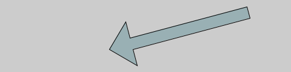

# Transparencias

Si se añade un parámetro extra a las palabras `fill()` y `stroke()`
podemos hacer que un objeto dibujado adquiera transparencia. Este nuevo
parámetro se conoce con el nombre de valor alfa. Su rango, como en el
caso de los colores, va de 0 a 255 (0 es completamente transparente, por
lo tanto no se dibuja, mientras que 255 es complatamente opaco). Valores
intermedios hace que cuando se solapen los colores se mezclen.

Escribe el siguiente código y fíjate en el en el cuarto número de
`fill()`.

``` {.java bgcolor="olive!10"}
size(480, 120);
noStroke();
background(204, 226, 225);    // Color celeste de fondo
fill(255, 0, 0, 160);         // Color rojo con transparencia
ellipse(132, 82, 200, 200);   // Círculo rojo
fill(0, 255, 0, 160);         // Color verde con transparencia
ellipse(228, -16, 200, 200);  // Círculo verde menos transparente
fill(0, 0, 255, 160);         // Color azúl menos transparente
ellipse(268, 118, 200, 200);  // Círculo azúl
```

Puedes ver que la figura [1] muestra círculos que se solapan. Fíjate en la
región de solapamiento. Prueba a cambiar el cuarto número de `fill()` a
255.

[Figura 1](pictures/ps8_1.png)

# Nuevas formas

Además de círculos, elipses, cuadriláteros y triángulos, podemos crear
nuevas formas y colorear su interior. Lo único que tenemos que dar son
los puntos que queremos que se conecten para formar la figura.

Como ejemplo vamos a crear una señal de dirección. Vamos a usar tres
palabras para ello: `beginShape()`, `vertex(X,Y)` y `endShape()`. La
primera palabra es para indicar que empezamos una nueva forma (en inglés
"begin" es empezar y "shape" es forma). La palabra "vertex" indica los
vértices de la forma, y sus argumentos son las coordenadas del vértice
$(X,Y)$. Por último decimos que acabamos con "endShape()".

Escribe el siguiente código:

``` {.java bgcolor="olive!10"}
size(480, 120);
beginShape();
fill(153, 176, 180);
vertex(180, 82);
vertex(207, 36);
vertex(214, 63);
vertex(407, 11);
vertex(412, 30);
vertex(219, 82);
vertex(226, 109);
endShape();
```

Observarás que aparce una flecha de color azulado como se muestra en la
figura [2](#fig:ps8_2){reference-type="ref" reference="fig:ps8_2"}. Pero
tenemos un problema, no se cierra.

{#fig:ps8_2 width="60%"}

Para cerrarla añade a la última palabra mágica el argumento "CLOSE"
(cerrar en inglés), `endShape(CLOSE)`:

``` {.java bgcolor="olive!10"}
```

Obtendremos la figura

{#fig:ps8_3 width="60%"}

# Comentarios

Ya hemos visto que para escribir un cometario o una anotación en el
propio programa se pueden usar dos barras inclinadas `//`. A partir de
las barras, el ordenador ignora lo que viene a continuación en esa
línea. Por tanto si las ponemos al principio de la línea ignora la línea
entera. Este comportamiento es útil cuando estamos experimentando con
las pociones.

Imagina que estamos intentando elegir el mejor color de una elipse y
escribimos

``` {.java bgcolor="olive!10"}
  size(200,200);
  fill(165, 57, 57);
  ellipse(100, 100, 80, 60);
```

Supón que quieres ver cómo queda con otro rojo, pero no quieres perder el
anterior por si el nuevo no te gusta. En vez de borrarlo, lo que podemos
hacer es comentar la línea y escribir una con el nuevo código RGB.

``` {.java bgcolor="olive!10"}
  size(200,200);
  //fill(165, 57, 57);
  fill(200, 39, 39);
  ellipse(100, 100, 80, 60);
```

Si queremos volver al color anterior para ver cómo era y comparar, para
no borrar la línea escribiríamos

``` {.java bgcolor="olive!10"}
  size(200,200);
  fill(165, 57, 57);
  //fill(200, 39, 39);
  ellipse(100, 100, 80, 60);
```

Más adelante veremos cómo comentar varias líneas a la vez sin tener que
escribir al principio de cada línea `//` cuando son líneas consecutivas.

# Experimenta tus pociones

1.  Introduce el siguiente código y dos criaturas mágicas aparecerán en
    la pantalla.

    ``` {.java bgcolor="olive!10"}
    ```

2.  Cambia los colores de las criaturas a rojo y verde, modificando el
    comando "fill()".

3.  Modifica añade vértices a la pócima del ejercicio anterior y crea
    tus propias criaturas.

4.  Oculta la criatura de la derecha detrás de una cortina
    semitransparente. Pista: pinta un rectángulo semitransparente de
    color celeste que semioculte la criatura mediante el parámetro alfa.
